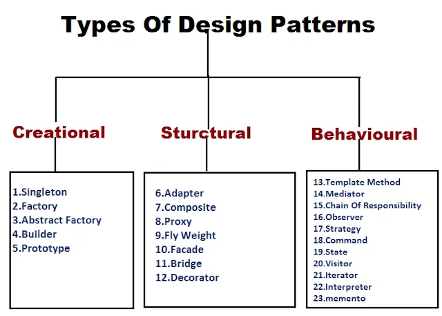

# MyDesingPatternExamples

1- Creational Patterns (Yaratımsal Kalıplar): Bu tasarım deseni nesneleri doğrudan new operatörü kullanarak oluşturmak yerine nesne oluşturma mantığını gizleyerek sınıflardan nesne oluşturmaya alternatif çözümler sunar. Bu program akışında hangi nesneye ihtiyaç varsa onu oluşturmada esneklik ve kolaylık sağlar.

2- Structural Patterns (Yapısal Kalıplar): Bu tasarım deseni nesneler arasındaki ilişkinin yapısını düzenlemek için çözümler sunar.

3- Behavioral Patterns (Davranışsal Kalıplar): Bu tasarım deseni çalışma zamanında nesneler arasındaki davranışlar için çözümler sunar.

## Kaynaklar
http://www.javaturk.org/tasarim-kaliplari/
https://talentgrid.io/tr/design-patterns/
https://www.hosting.com.tr/blog/design-patterns/
https://www.linkedin.com/pulse/design-patterns-yaz%C4%B1l%C4%B1m-geli%C5%9Ftirme-s%C3%BCrecinde-kullan%C4%B1lan-osman-do%C4%9Fan/