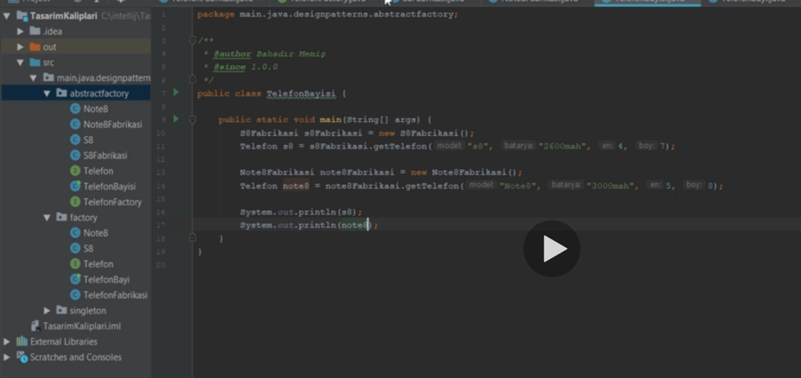

Örnegin telefonu bayiler degil fabrikalar üretir.
Bir tane Telefon adinda interface olusturmakla basliyoruz. Telefon Bayileri, fabrikalarin olusturdugu telefonlari satiyorlar. Telefon ve Fabrikasi icin interface ler olusturuldu.

Extensibility yani genisletilebirlik icin factory pattern kullanilir.  Böylece strong coupling in önüne gecmis oluruz.

