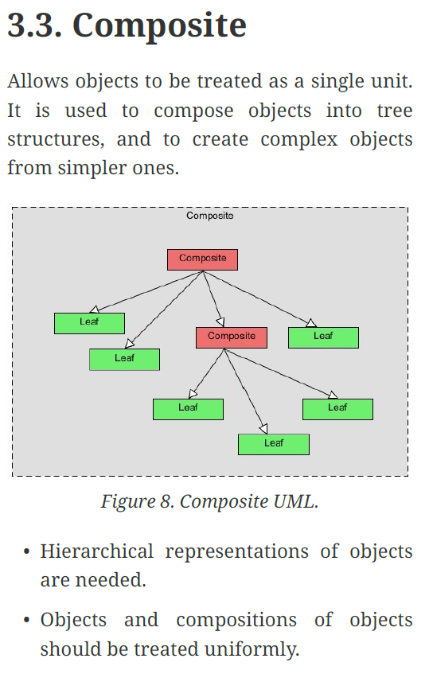

# Composite (Bileşik) Design Pattern

Kendi içlerinde birbirlerinden farklı olan bir grup nesnenin sanki tek bir bütün nesneymiş gibi kullanılabilmesine imkan sağlayan tasarım desenine Composite Design Pattern denir. Bu tasarımın görevi, nesneleri bir ağaç yapısında birleştirip uygulamanın genelindeki parça bütün ilişkisini yeniden düzenleyip şekillendirmektir.

Yazılımcı, kullanıcının isteği doğrultusunda aynı türden veya farklı türlerden bir nesne topluluğu kullanmak zorunda ise, karmaşadan ve karışıklıktan kurtulmak için, tüm parçalar ile tek tek uğraşmaktansa bileşik kalıp kullanabilir.

Örnek vermek gerekirse elimizde daha sonra film türlerini implement edeceğimiz bir Movie interface’i var. Ve bu interface’in içerisinde tüm, Movie türleri tarafından kullanılması istenen showMovieInfo() isimli bir metot var.

Daha sonra bu Movie interface’ine implement edilen bir Comedy ve Horror türünde filimlerimiz olduğunu düşünelim. Üretilirken film ile ilgili çeşitli bilgiler alan bir Constructor’a sahip olan bu class’lar ayrıca showMovieInfo() metodunu override ediyor ve kendisi ile ilgili tüm bilgileri ekrana yazdırıyor.

Şimdi elimizde birden fazla film türünde birden fazla obje olduğunu düşünelim. Bunlarla ilgili toplu işlemeler yapmak istediğimizde mesela her birinin bilgileri ekrana yazdırmak istediğimizde mecburen gidip teker teker hepsinin showMovieInfo() metodunu çağırmamız gerekecek.

Onun yerine Movie interface’ine implement edilen ve içerisinde Movie data türünde objeler içeren bir listin yer aldığı Container bir class’ımız olsa. Bu listeye her türden Movie nesneleri eklemek ve silmek için add ve remove metotlarımız olsa ve birde içerdiği tüm filmler ile ilgili toplu işlemler yapabilse. Mesela showMovieInfo() metodunu override ederek bir for döngüsü ile showMovieInfo() metodunu kullanarak tüm filmlerin bilgilerini ekrana yazdırsa güzel olmaz mıydı?.

İşte bu yapıyı Composite Design Patter ile oluşturuyoruz. Bu sayede film objelerimizi container’daki bu listeye ekleyip, aynı türden fakat bir birinden farklı objeler üzerinde pek çok işlemi toplu halde gerçekleştirebiliyoruz.

