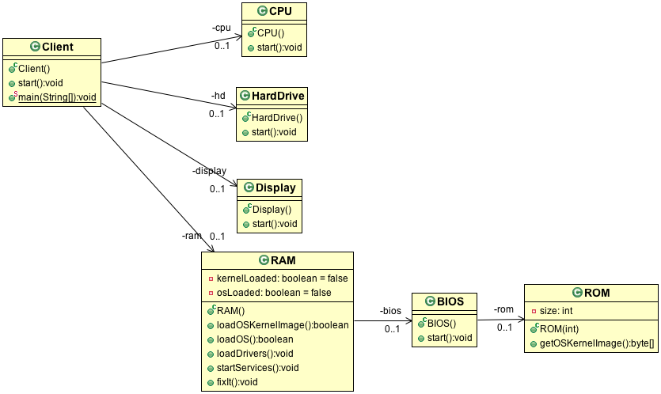
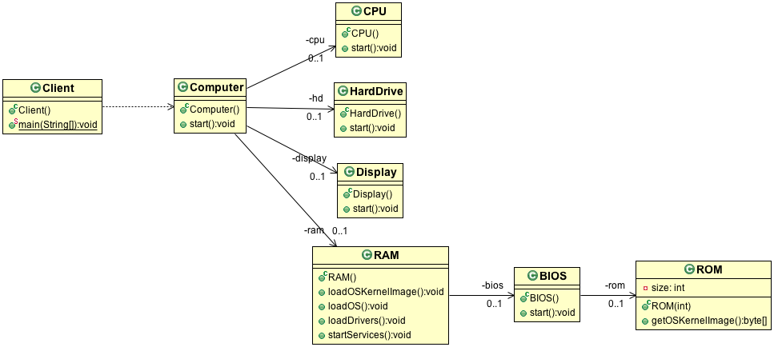

Evet bu amaç açıklamasından da anlaşıldığı gibi Façade, karmaşık iş süreçlerini saklamakta kullanılan bir kalıptır. Çoğunlukla kullandığımız algoritmalar veya iş mantığı, bir süreç oluşturacak şekilde, pek çok farklı nesneden hizmet alarak ilerler. Süreç, hangi nesneden hangi durumlarda hizmet alınacağı bilgisini detayıyla ifade eder. Süreç, aynı zamanda pek çok iş kuralı ile de yönlendirilir. Böyle durumlarda client nesnelerin, süreci tüm detayıyla bilmelerini istemeyiz.

Facade (Ön Yüz) Pattern Hangi Sorunu Çözer?

Facade Pattern, "Karmaşıklığı gizleme ve yönetme" sorununu çözer.

Bir yazılım projesinde bazen bir işi yapmak için arka planda onlarca farklı sınıfın, kütüphanenin veya servisin sırayla ve belirli ayarlarla çalıştırılması gerekir. Eğer bu karmaşık yapıyı (Subsystems) doğrudan ana kodun (Client) içine yazarsan şu sorunlar oluşur:

    Sıkı Bağımlılık (Tight Coupling): Ana kodun, arka plandaki tüm detayları bilmek zorunda kalır.

    Tekrar Eden Kod: Aynı işlemi başka bir yerde yapmak istersen, o 10 satırlık karmaşık kodu kopyalaman gerekir.

    Bakım Kâbusu: Arka plandaki kütüphanede bir metot adı değişirse, kodunda bunu kullanan 50 farklı yeri düzeltmen gerekir.

Facade Çözümü:
Araya bir "Yönetici" (Facade) sınıfı koyarsın. Ana kod sadece bu yöneticiye "İşi yap" der. Yönetici arka plandaki karmaşık işleri halleder.

Gerçek Hayat Analojisi:
Bir arabayı çalıştırırken (Start tuşu = Facade), motorun içine yakıt püskürtülmesini, ateşleme bujilerinin sırasını veya hava girişini (Subsystems) manuel olarak siz yapmazsınız. Tuşa basarsınız, araba karmaşık işleri halleder.

Link: https://www.javaturk.org/tasarim-kaliplari-facade-on-yuz-i/

Iyi olmayan hatali yöntem:

Facade Pattern uygulanmis dogru yöntem:
