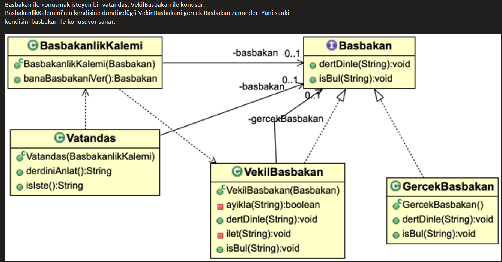

# Proxy Pattern

Proxy (Vekil) Pattern, temel olarak "Erişim Kontrolü ve Ara Yüzey" sorununu çözer.

Bir nesneye doğrudan erişmenin pahalı, tehlikeli veya imkansız olduğu durumlarda, o nesnenin yerine geçecek bir "temsilci" (vekil) kullanmanızı sağlar.

Proxy Pattern'in çözdüğü 3 ana sorun/senaryo şunlardır:

    Performans Sorunu (Virtual Proxy): Çok büyük ve ağır bir nesneyi (örneğin 5GB'lık bir video veya devasa bir veritabanı bağlantısı), kullanıcı gerçekten ihtiyaç duyana kadar yüklememek gerekir. Proxy, istek gelene kadar bekler (Lazy Loading).

    Güvenlik Sorunu (Protection Proxy): Hassas bir nesneye (örneğin Admin paneli) herkesin erişmesini istemezsiniz. Proxy, "Kimsin? Yetkin var mı?" diye sorar, yetki varsa gerçek nesneye iletir.

    Uzak Erişim Sorunu (Remote Proxy): Nesne başka bir sunucuda (farklı bir JVM'de veya bulutta) yaşıyor olabilir. Proxy, sanki nesne yerelmiş gibi davranır ama arka planda ağ (network) trafiğini yönetir.

Gerçek Hayat Analojisi: Şirket CEO'su ve Asistanı

Bir şirketin CEO'suyla görüşmek istediğinizi düşünün.

    CEO (Real Subject): Asıl işi yapan, önemli kişi.

    Asistan (Proxy): CEO'nun kapısındaki kişi.

Doğrudan CEO'nun odasına dalamazsınız. Önce asistanla konuşursunuz.

    Filtreleme (Güvenlik): Asistan, "Randevunuz var mı?" diye sorar. Yoksa sizi geri çevirir (CEO'yu korur).

    Yönlendirme (Performans): Basit bir sorunuz varsa asistan cevaplar, CEO'yu meşgul etmez. Sadece çok önemliyse sizi içeri alır.

